# HGMAE源码流程

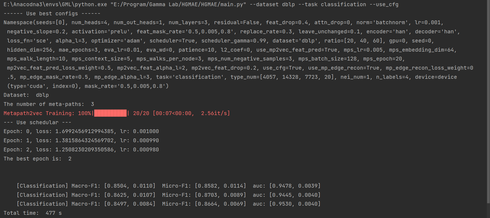

初步跑通源码。设置少一点epoch，完整的打印如图

用debug看流程

1. build_args用parser.add_argument设置参数。parser.parse_known_args得到args(Namespace)，用setattr设置args的kv对。

2. use_cfg=True时，函数load_best_config()从configs.yml里读取参数，形式为dict。遍历用setattr设置args的kv对

3. 设置好args后，传入main()
   
   1. seed全部设置为args.seed
   
   2. 根据args.dataset来读取数据集，load_data()中调用对应的数据集函数load_dblp(ratio, type_num)。
      
      1. ratio=[20,40,60]（暂时不知道是干嘛的）。源码读取时用np.load，读取的是.npy, .npz文件，train，val，test都有_20,_40,_60的文件。读取到的train，val，test分别是三个list，即[train_20.npy, train_40.npy, train_60.npy]，其他两个数据集也是如此。最后data=load_dblp()返回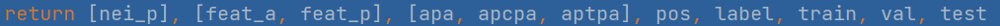
      
      2. 调用process_data_in_pyg(data[0])，data[0]记为neigs，一番操作之后，得到了metapaths和异质图g，此时g还是pyg的异质图。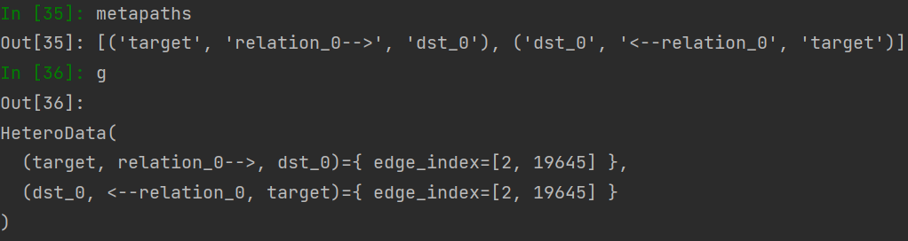
         process_data_in_pyg(data[0])返回g, metapaths
      
      3. load_data()返回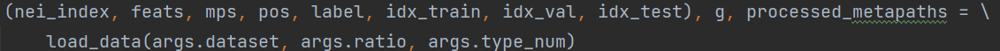
   
   3. 得到的g和metapahs都是pyg形式的，然后使用了PYG里面的库metapath_model=MetaPath2Vec(...)训练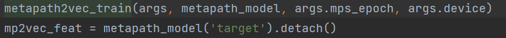，
      
      得到mp2vec_feat，根据论文，这是Positional Feature Prediction环节的第一步
      
      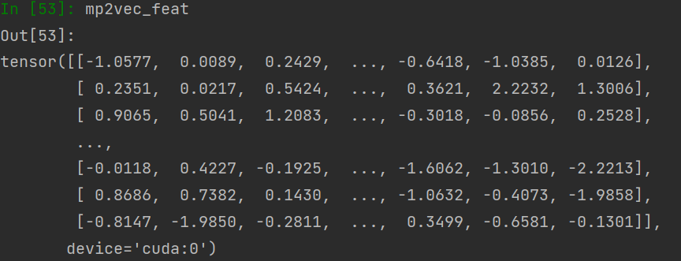
      之后他del了metapath_model，将mp2vec_feat转移到cpu上，并且empty_cache。
      
      然后 ```feats[0] = torch.hstack([feats[0], mp2vec_feat])``` 将mp2vec_featp拼接到了原来节点的feat上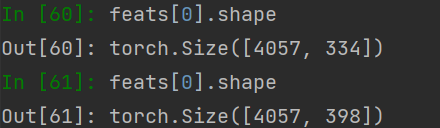
      
      原来feat是334维，也就是focused_feature_dim = feats_dim_list[0]。
   
   4. 模型PreModel（位于edcoder.py）
      
      ```python
      PreModel(
        (encoder): HAN(
          (han_layers): ModuleList(
            (0): HANLayer(
              (gat_layers): ModuleList(
                (0-2): 3 x GATConv(
                  (fc): Linear(in_features=334, out_features=256, bias=False)
                  (feat_drop): Dropout(p=0.4, inplace=False)
                  (attn_drop): Dropout(p=0, inplace=False)
                  (leaky_relu): LeakyReLU(negative_slope=0.2)
                  (activation): PReLU(num_parameters=1)
                  (norm): BatchNorm1d(256, eps=1e-05, momentum=0.1, affine=True, track_running_stats=True)
                )
              )
              (semantic_attention): SemanticAttention(
                (project): Sequential(
                  (0): Linear(in_features=256, out_features=128, bias=True)
                  (1): Tanh()
                  (2): Linear(in_features=128, out_features=1, bias=False)
                )
              )
            )
            (1-2): 2 x HANLayer(
              (gat_layers): ModuleList(
                (0-2): 3 x GATConv(
                  (fc): Linear(in_features=256, out_features=256, bias=False)
                  (feat_drop): Dropout(p=0.4, inplace=False)
                  (attn_drop): Dropout(p=0, inplace=False)
                  (leaky_relu): LeakyReLU(negative_slope=0.2)
                  (activation): PReLU(num_parameters=1)
                  (norm): BatchNorm1d(256, eps=1e-05, momentum=0.1, affine=True, track_running_stats=True)
                )
              )
              (semantic_attention): SemanticAttention(
                (project): Sequential(
                  (0): Linear(in_features=256, out_features=128, bias=True)
                  (1): Tanh()
                  (2): Linear(in_features=128, out_features=1, bias=False)
                )
              )
            )
          )
          (activation): PReLU(num_parameters=1)
        )
        (decoder): HAN(
          (han_layers): ModuleList(
            (0): HANLayer(
              (gat_layers): ModuleList(
                (0-2): 3 x GATConv(
                  (fc): Linear(in_features=256, out_features=334, bias=False)
                  (feat_drop): Dropout(p=0.4, inplace=False)
                  (attn_drop): Dropout(p=0, inplace=False)
                  (leaky_relu): LeakyReLU(negative_slope=0.2)
                  (activation): Identity()
                )
              )
              (semantic_attention): SemanticAttention(
                (project): Sequential(
                  (0): Linear(in_features=334, out_features=128, bias=True)
                  (1): Tanh()
                  (2): Linear(in_features=128, out_features=1, bias=False)
                )
              )
            )
          )
          (activation): PReLU(num_parameters=1)
        )
        (encoder_to_decoder): Linear(in_features=256, out_features=256, bias=False)
        (encoder_to_decoder_edge_recon): Linear(in_features=256, out_features=256, bias=False)
        (enc_out_to_mp2vec_feat_mapping): Sequential(
          (0): Linear(in_features=256, out_features=64, bias=True)
          (1): PReLU(num_parameters=1)
          (2): Dropout(p=0.2, inplace=False)
          (3): Linear(in_features=64, out_features=64, bias=True)
          (4): PReLU(num_parameters=1)
          (5): Dropout(p=0.2, inplace=False)
          (6): Linear(in_features=64, out_features=64, bias=True)
        )
      )
      ```
      
      模型\_\_init\_\_()阶段，从args里读取各种参数。
      
      `encoder/decoder=setup_module()，setup_module()`里面使用了很多层HAN（取决于num_layers）, han.py，gat.py，里的层都是作者自己实现的，中间用到了dgl的一些函数，不知道为什么不直接使用dgl实现的HAN，**这一步不知道自己实现的时候能不能用openhgnn或者dgl自带的layer来实现。**
   
   5. 然后定义`scheduler = torch.optim.lr_scheduler.ExponentialLR`，将model和各种输入转到gpu上。
      
      `loss, loss_item = model(feats, mps, nei_index=nei_index, epoch=epoch)`，是一次`forward`。forward中有根据args.use_mp2vec_feat_pred来选择是否使用mp2vec_feat，可以实现效果对比。
      
      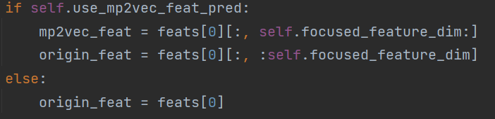
      
      mps_to_gs应该是将pyg的异质图（3 metapaths）mps 转换为dgl的3个同质图gs，gs是dgl.graph[]。
      
      先后进行`type-specific attribute restoration`，`mp based edge reconstruction`，
   
   6. 
   
   7. 在循环中训练并打印loss和lr，并记录best时`best_model_state_dict = model.state_dict()`。**循环中使用了early stopping**，当loss > best**连续**超过argas.patience（10）时早停。
   
   8. 训练完后进行eval，``embeds = model.get_embeds(feats, mps, nei_index)``。
      
      在get_embeds()中：
      
      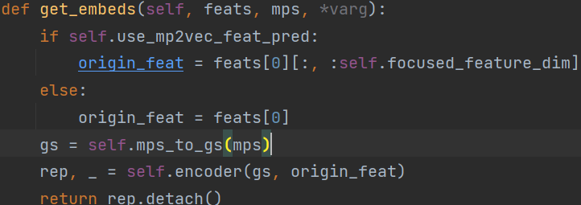
      
      根据args.use_mp2vec_feat_pred来决定要不要使用mp2vec，这里应该是对比实验。
      
      mps_to_gs应该是将pyg的异质图（3 metapaths）mps 转换为dgl的3个同质图gs，gs是dgl.graph[]。`self.encoder(gs,origin_feat)`,调用了encoder（setup_module的HAN）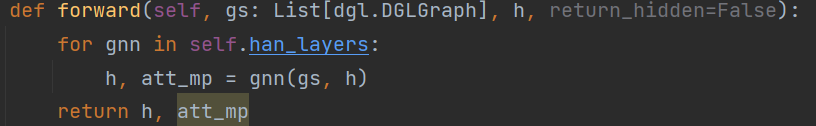，返回h和注意力
      
      最后得到
      
      embeds：，编码成了256维。
      
      embeds输入到LogReg（linear）里训练并预测。对ratio=[20,40,60]进行了三次预测得到结果

## 问题：

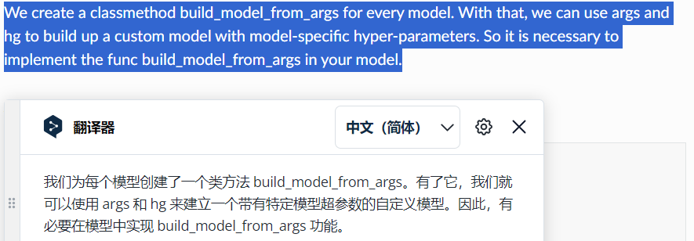

HGMAE里面的一个步骤是使用metapath2vec提取节点特征，这是否意味着，在用户使用openhgnn实现的HGMAE模型时，假如用户训练时使用了

```python
model=HGMAE(args)
model(hg,h_dict)
```

这里的h_dict是不是未经过处理的原始异质图hg的特征？

HGMAE是生成式自监督学习，forward里面应该实现训练的过程，返回loss，用户在def train(): 里面来进行训练迭代。然后要使用训练之后得到的embedding时就调用model.get_embeds()。（参考[openhgnn.models.HeCo 源代码]([openhgnn.models.HeCo &mdash; OpenHGNN 文档](https://openhgnn.readthedocs.io/zh-cn/latest/_modules/openhgnn/models/HeCo.html#HeCo))）
