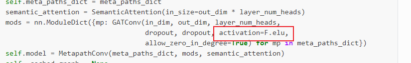
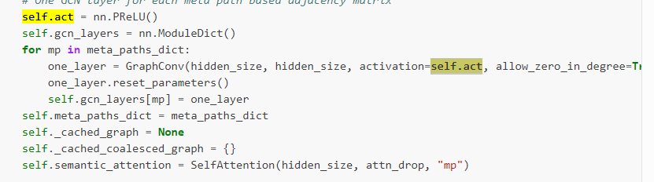
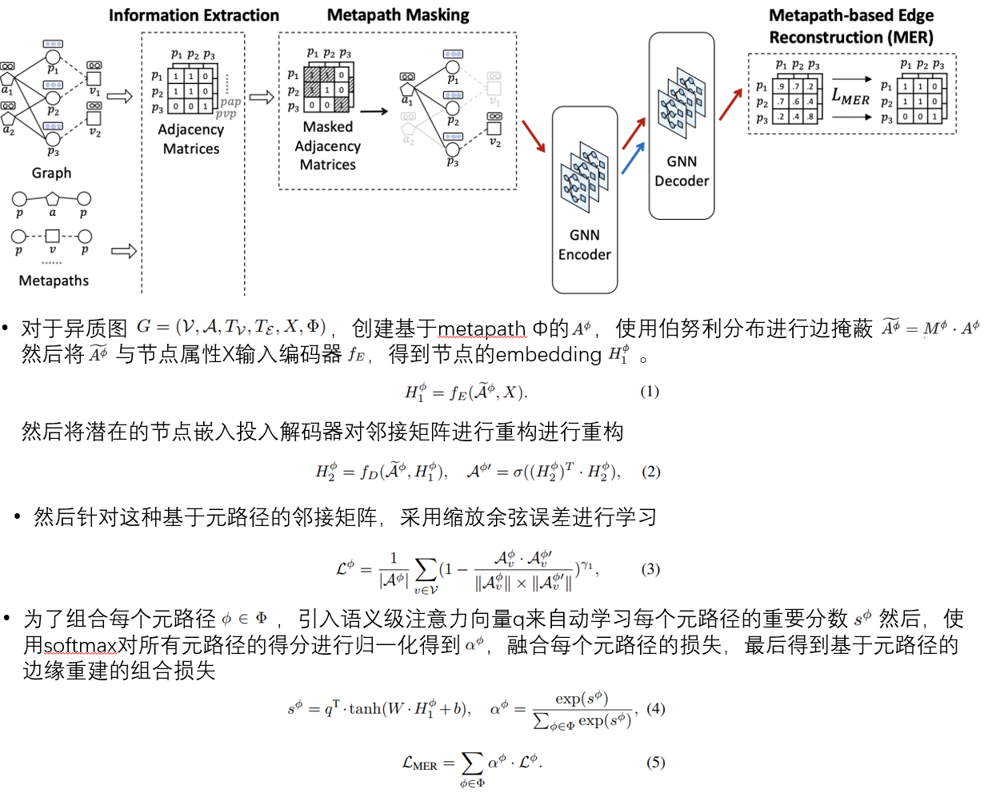

### 1

activation是否可选

下图是openhgnn的HAN，没有给用户选择，

下图是HeCo，也是固定的

HGMAE的源码中activation有给多个选择，但是几个数据集的测试中都是用了‘prelu’，那是不是只需要固定这个activation为prelu就可以了？

### 2

源码中使用了HAN，但是在HAN中的各个HANLayers之间加了norm，openhgnn的HAN没有norm，需要重写吗？

可能这个只是工程上的优化，吉星源学长说直接用openhgnn里面的HAN，如果效果差太多再改。

### 3

这一部分，按照论文中的看，n个metapath有不同的n个adj_matrix，先编码后解码得到n个重构的recon_adj_matrix，然后一一的计算损失，最后根据metapath_attention来加权求和。

但是源码中，n个metapath直接输入到HAN中，最后的输出只得到1个recon_adj_matrix，然后这个adj_matrix分别和n个adj_matrix计算损失，最后根据metapath_attention加权求和

论文的编码器和解码器固定了类型，都是HAN，是否要提供其他的可选类型？
